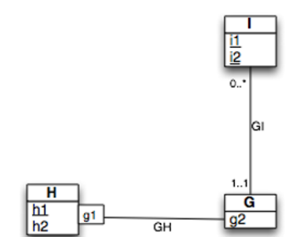

# 2023-BDR-Exercices

Git repo for the BDR's exercices.

## Exercices 6

Relations :

- H(<u>h1</u>, h2)
- G(<u>h1</u>,<u>g1</u>,g2)
- I(<u>i1</u>, <u>i2</u>,h1,g1)

Contraintes :

- G.h1 référence H.h1
- (I.h1,I.g1) référence (H.h1,G.gi)
- I.h1 NOT NULL
- I.g1 NOT NULL

## Exercices 7

Relations :

- TE_A(<u>A</u>, B)
- TE_B(<u>A</u>, <u>C</u>, E, D)
- TE_C(<u>E</u>, F)
- TE_D(<u>H</u>, I)
- G(<u>E</u>, <u>H</u>, G)
- TE_E(<u>J</u>, K)

Contraintes :

- TE_B.A référence TE_A.A
- TE_B.E référence TE_C.E
- G.E référence TE_C.E
- G.H référence TE_D.H
